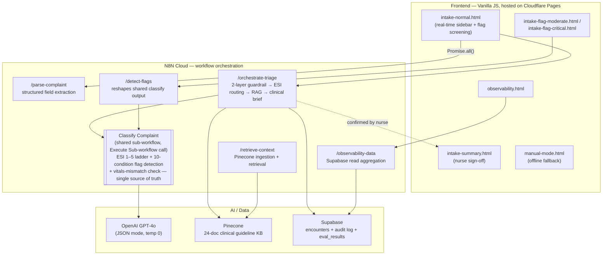

# ER Triage AI Co-pilot

A real-time AI assistance layer for ER triage nurses — surfaces structured intake fields and critical-condition flags as a nurse types, with confidence-tiered alerting and a nurse-in-the-loop confirmation step before anything reaches the EMR.

**Live demo:** https://er-triage-ai-co-pilot.pages.dev

> Personal AI-engineering build project — not a production clinical system. Built to demonstrate hands-on agentic AI architecture, RAG, evaluation rigor, and safety-guardrail design for real-world regulated-adjacent workflows.

---

## The Problem

ER triage nurses make high-stakes acuity decisions (ESI 1–5) from a brief verbal complaint, under time pressure, with no decision support beyond training and experience. A missed verbal cue — "throat feels tight," "slurring words," "wants to hurt himself" — can be the difference between a patient waiting in a lobby and a patient who needed a resuscitation bay five minutes ago.

This project asks: can an LLM listen alongside the nurse, in real time, and surface a second opinion — without ever making the decision for her, and without ever writing to the record without her sign-off?

## What It Does

- **Structured field extraction** — as the nurse types a free-text chief complaint, the system extracts category, onset, duration, symptoms, trigger, and context into structured intake fields in real time.
- **Critical flag detection** — every complaint is screened against 10 named emergent conditions (Acute MI, Stroke, Anaphylaxis, Sepsis, Respiratory Distress, Suicidal Ideation, Major Trauma, Hypertensive Crisis, Altered Mental Status, Anaphylactoid Reaction), each requiring a **literal, quotable phrase** from the complaint text — vitals alone can never trigger a flag.
- **Tiered alerting** — confidence 70–89% surfaces an amber "review" card; confidence ≥ 90% surfaces a red pulsing critical alert and blocks submission until the nurse explicitly confirms.
- **Independent vitals-consistency check** — runs on every request regardless of flag outcome: any vital that crosses a critical threshold (SpO2 <90%, BP ≥180/120, GCS ≤13, HR ≥150/≤40, Temp ≥39.5°C) and isn't explained by the complaint text is surfaced separately, so an abnormal vital is never silently absorbed or ignored.
- **Agentic ESI triage** — a tiered orchestrator classifies acuity (ESI 1–5), retrieves grounded clinical guidelines via RAG, and generates a structured clinical brief (immediate actions, protocol summary, time targets) for Critical/Urgent presentations — never inferring a drug name, dosage, or action unsupported by retrieved guidelines.
- **Nurse-in-the-loop, always** — every AI suggestion is accept/dismiss; nothing is written to the record without explicit nurse confirmation. Critical-flag screens block submission until confirmed.
- **Manual-mode fallback** — if the AI backend is unreachable, the UI degrades to a manual paper-equivalent workflow rather than blocking intake.
- **Full audit trail + observability** — every nurse action (accept/dismiss) is logged; a live dashboard tracks branch distribution, latency, token cost, and eval pass-rate trend.

## Architecture



**Design decisions worth noting:**
- **Classification is a single shared sub-workflow**, called via N8N's in-instance Execute Sub-workflow node from both the orchestrator and the flag-detection endpoint — not two independently-maintained prompts. This closed a real drift risk: the two used to reason separately over the same complaint text for overlapping conditions, and had already diverged (see Build Log below).
- **Parallelism happens at the frontend, not inside N8N.** N8N does not execute fan-out branches concurrently within one workflow run — `parse-complaint` and `orchestrate-triage` are two independent webhooks, parallelized via `Promise.all()` in the browser. Confirmed ~2.9s actual latency vs. ~20s when both calls lived in one workflow.
- **Flag detection requires literal textual evidence.** Vitals can corroborate an already text-confirmed flag but can never independently decide one — this was hardened over multiple iterations after early versions let extreme vitals alone imply a condition (e.g., inferring "severe headache" from "dizzy").

## Tech Stack

| Layer | Technology |
|---|---|
| Frontend | Vanilla HTML/CSS/JS, hosted on Cloudflare Pages |
| Backend orchestration | N8N Cloud (workflow automation) |
| AI reasoning | OpenAI GPT-4o, JSON mode, temperature 0 |
| RAG / knowledge retrieval | Pinecone (24-document clinical guideline corpus) |
| Data / audit | Supabase (Postgres + RLS) |
| Evaluation | Python (300-case synthetic eval harness, HHH scorecard) |

## Safety & Evaluation

- **300-case synthetic evaluation** (seed 99) — 100% recall on confirmed Stroke/MI/Anaphylaxis-pattern presentations, 0 wrong-source RAG attributions.
- **2-layer input guardrail** — client-side regex (Layer 1) + GPT-4o classifier (Layer 2) rejecting non-clinical/adversarial input (prompt injection, role-injection attempts) before it reaches the reasoning pipeline — 16/16 adversarial test cases passing.
- **Clinical action constraints** — no drug names or dosages ever generated; every recommended action must cite a retrieved guideline or `clinical_standard`.
- **PII boundary** — patient name/MRN are not persisted to the audit database; only de-identified encounter data (complaint, vitals, ESI, disposition) is stored.
- **Consistency-checked** — identical input produces identical ESI/flag/disposition output across repeat runs.

Full HHH (Helpful/Honest/Harmless) scorecard, evaluation methodology, and build history: see [`ROADMAP.md`](./ROADMAP.md) and [`project_build_summary.md`](./project_build_summary.md).

## Repository Structure

```
er-triage-phase-1/
├── mockups/              # Frontend screens (intake, flag alerts, summary, queue, observability)
├── n8n-workflows/        # N8N workflow JSON exports (source of truth for backend logic)
│   └── node-prompts/     # Extracted GPT-4o system prompts, versioned separately for readability
├── Evaluations/          # 300-case eval harness, HHH scorecard, eval results
├── knowledge_base/       # Clinical guideline source documents (ingested into Pinecone)
├── supabase/              # Database schema + migrations
├── scripts/              # Deploy/env-generation helpers
├── ROADMAP.md            # Full phase-by-phase build roadmap and decision log
└── prd_er_triage_ai.md   # Product requirements document
```

## Status

Currently in post-launch hardening. Core agentic pipeline (2-layer guardrails → tiered ESI classification → RAG-grounded clinical brief) is live in production with a 100%-recall evaluation baseline. See [`ROADMAP.md`](./ROADMAP.md) for the current phase, open items, and full decision history.

## Author

Built by Venkat Krishnan Chellappa ([LinkedIn](https://linkedin.com/in/venkat-krishnan-chellappa)) as a hands-on AI engineering portfolio project — agentic architecture, RAG, evaluation design, and product/PM decision-making, end to end.
